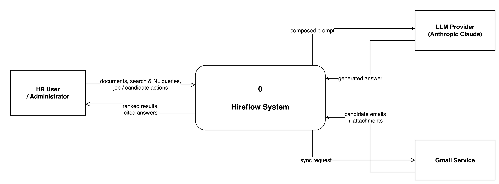
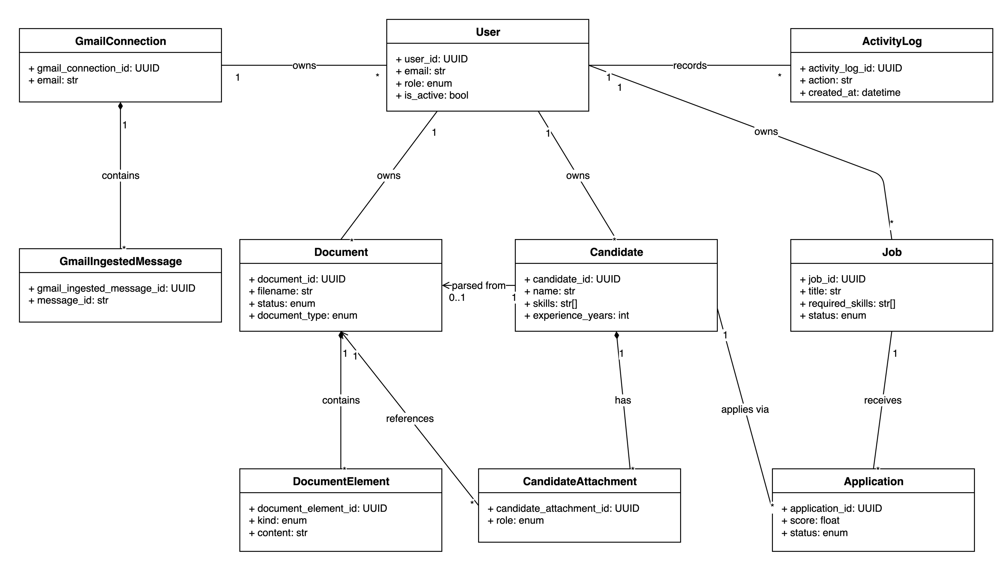
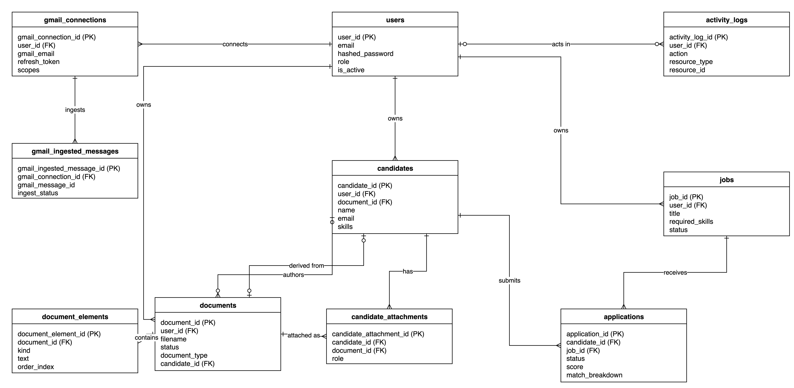
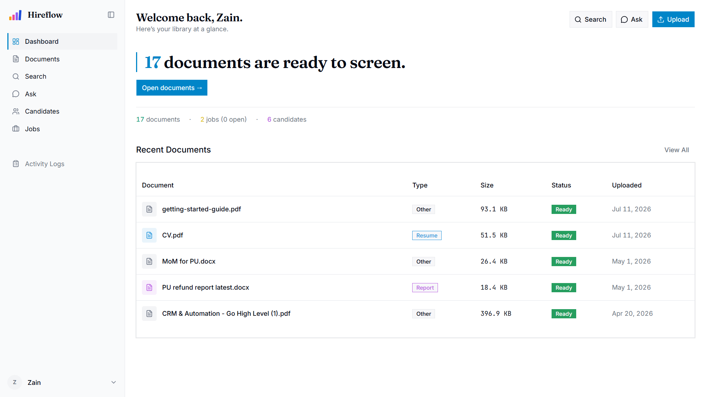
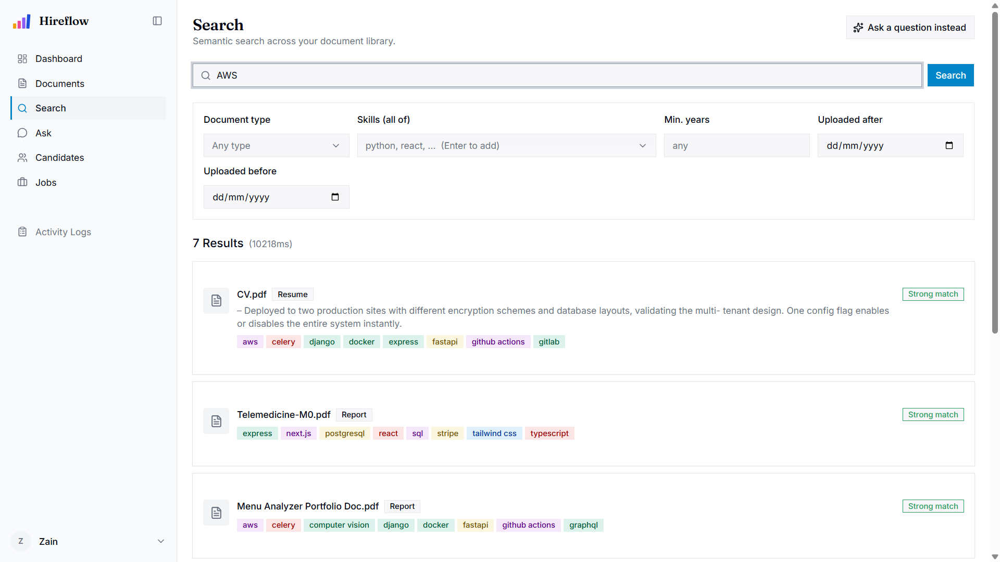
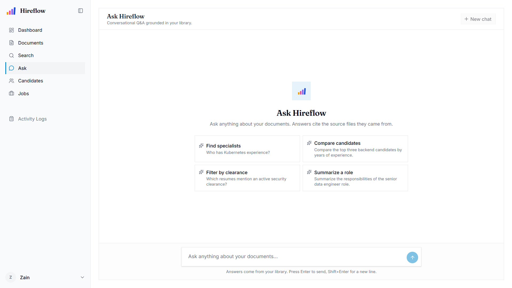
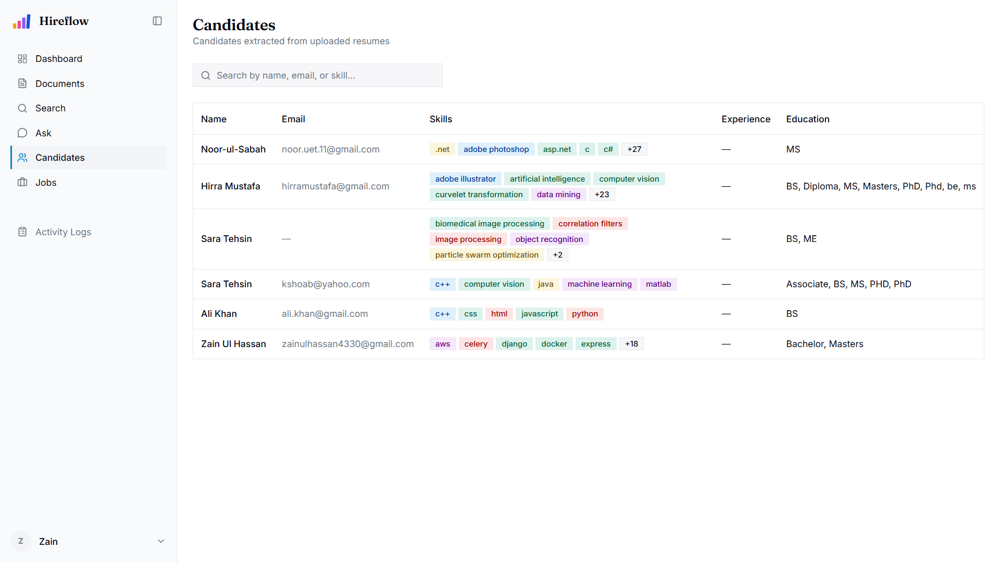

# Presentation Layout

- Problem Statement
- Objectives
- Existing System & Literature Review
- Proposed System & Architecture
- Implementation
- System Design (DFDs, Class Diagram, ERD)
- Results & Outputs
- Testing
- Conclusion & Future Scope
- References

# Problem Statement

- Organizations manage large volumes of unstructured HR documents: resumes, job descriptions, reports, and scanned correspondence.
- Manual document review is slow, labour-intensive, and inconsistent; HR teams spend most of their time reviewing resumes, around 23 hours to fill a single position.
- Keyword search matches literal words, not meaning, so a search for "machine learning engineer" misses an "ML researcher".
- Existing tools rarely answer plain-language questions over a company's own documents with any proof of where the answer came from.

# Objectives

- Ingest and process heterogeneous documents (PDF, Word, scanned images) with OCR text extraction.
- Enable semantic search and retrieval over the document collection.
- Provide grounded question answering via Retrieval-Augmented Generation (RAG) with source citations.
- Automate resume screening and ranking against defined job criteria.
- Automate candidate intake from Gmail and reporting.

# Existing System & Literature Review

| System / Approach | Semantic Retrieval | Natural-Language Q&A | Automated Ranking | Provenance / Citations | Open / On-Premise |
|---|---|---|---|---|---|
| Traditional ATS (Greenhouse, Workday) | No (keyword) | No | Rule-based only | Limited | Mostly cloud |
| AI recruitment (Eightfold AI) | Yes | Limited | Yes (ML) | Weak | No (proprietary) |
| Cloud Document AI | Partial | No | No | N/A | No (cloud) |
| RAG frameworks (LangChain) | Yes | Yes | Not HR-specific | Yes (if built) | Yes (self-host) |
| **Hireflow (proposed)** | **Yes** | **Yes** | **Yes (weighted)** | **Yes (typed)** | **Yes** |

# Proposed System & Architecture

- **Frontend & Backend:** React 19 (TypeScript) single-page app with a layered FastAPI (Python) backend.
- **Document Processing:** PDF, Word, scanned documents, and Gmail attachments processed with PyMuPDF and Tesseract OCR.
- **Semantic Search:** extracted text is chunked, embedded with sentence-transformers, and stored in ChromaDB.
- **RAG Question Answering:** retrieved context is supplied to an LLM (Anthropic Claude) to generate accurate, source-cited answers.
- **AI-Powered HR Screening:** candidates are scored and ranked against job criteria with a transparent, weighted breakdown.
- **Data Storage & Security:** PostgreSQL for application data, MinIO for files, Redis and Celery for async processing; JWT auth with per-user data isolation.

# System Architecture

# Implementation

- Product vision and system design
- Frontend design and implementation (React 19, TypeScript, Tailwind, shadcn/ui)
- Backend design and implementation (layered FastAPI: API, Service, Domain, Adapter)
- Asynchronous document-processing pipeline (Celery worker)
- Hybrid search and RAG engine
- Software testing
- Containerization of the system (Docker)
- User-manual preparation

# DFD Level 0 (Context)

# DFD Level 1

# Class Diagram

# Database Design (ERD)

# User Interface — Dashboard

# User Interface — Semantic Search

# User Interface — Ask (RAG Q&A)

# User Interface — Candidate Screening

# Results & Outputs

- **Retrieval latency:** hybrid search 72 ms median, 167 ms at the 95th percentile (server-side).
- **Ingestion throughput:** about 44 s per text PDF to READY, about 4.1 s per scanned page; roughly 1.5 documents / minute at worker concurrency 1.
- **Embedding & LLM response:** 0.57 ms per chunk on GPU; RAG time-to-first-token about 947 ms; full streamed answer about 1.5 s.
- **Prototype:** 31 working REST API endpoints; grounded, source-cited answers; out-of-scope questions refused instead of hallucinated.

# Testing

- **Unit testing** of domain logic and services with in-memory fakes (no database or Docker required).
- **Integration & API testing** driving full request/response cycles through FastAPI against real backing services.
- **Manual & UAT-style testing** through the browser and curl for interactive surfaces (streaming chat, drag-and-drop, keyboard navigation).
- **Static analysis and linting** (ruff, ESLint) run before every commit.

# Testing — Key Test Cases

| Test Case | Scenario | Expected Result | Status |
|---|---|---|---|
| TC-AUTH-006 | Login with valid credentials | HTTP 200; access + refresh tokens issued | Pass |
| TC-DOCS-001 | Upload PDF appears as ready | Status reaches `ready` within 60 s | Pass |
| TC-DOCS-046 | Auto-candidate from a resume | Candidate created on the on-ready hook | Pass |
| TC-SEARCH-005 | HR user sees only own documents | Owner scope enforced; empty result set | Pass |
| TC-RAG-001 | Grounded answer with citations | Answer cites at least one source | Pass |
| TC-RAG-002 | Out-of-scope question | Exact sentinel; no fabricated citations | Pass |

# Conclusion

- Successfully developed an AI-powered HR platform that automates document processing, semantic retrieval, and resume screening.
- Implemented RAG-based document retrieval with source-cited answers, improving search accuracy and reducing manual effort.
- Automated the recruitment workflow through AI-based candidate ranking, Gmail resume synchronisation, and shortlist generation.
- Designed a scalable, modular architecture with interchangeable AI components, ensuring maintainability and future extensibility.

# Future Scope

- Enhance security with login rate-limiting, token revocation, and stronger file validation.
- Expand functionality with multilingual support, ATS integration, analytics dashboards, and real-time notifications.
- Improve performance through quantitative benchmarking and domain-specific AI models for retrieval and ranking.
- Increase accessibility with a native mobile application for recruiters.

# References

- Lewis, P., et al. (2020). Retrieval-Augmented Generation for Knowledge-Intensive NLP Tasks. *NeurIPS 33*, 9459–9474.
- Reimers, N., & Gurevych, I. (2019). Sentence-BERT: Sentence Embeddings using Siamese BERT-Networks. *EMNLP*.
- Vaswani, A., et al. (2017). Attention Is All You Need. *NeurIPS 30*.
- Johnson, J., Douze, M., & Jégou, H. (2019). Billion-scale Similarity Search with GPUs (FAISS). *IEEE TBD*.
- Smith, R. (2007). An Overview of the Tesseract OCR Engine. *ICDAR*.
- Anthropic. (n.d.). *Claude Documentation.* docs.anthropic.com

# Thank You

**Any Queries?**

AI Powered HR Screening and Document Retrieval System Using RAG
