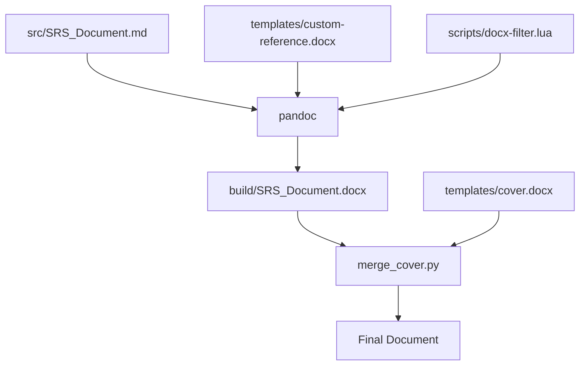

# FYP Documentation

This repository maintains project documentation using Markdown as the source format, with automated generation of Word documents.

## Why This Approach

- **Single source of truth**: All team members edit the same Markdown files, eliminating version conflicts from passing Word docs around
- **Clean formatting**: Consistent styling applied automatically via templates, no manual formatting needed
- **Version control friendly**: Markdown diffs are readable, making it easy to track changes and review contributions
- **Automated builds**: GitHub Actions generates the Word document on every push, ensuring the latest version is always available

## How It Works



## Usage

### Local Build

```bash
# Install dependencies
pip install python-docx docxcompose
brew install pandoc  # or apt-get install pandoc

# Build the document
./scripts/build.sh
```

Output: `build/SRS_Document.docx`

### Automatic Build

Push changes to `main` branch. GitHub Actions will build and commit the updated document automatically.

## Project Structure

```
src/                  # Markdown source files
templates/            # Word templates (cover page, reference styles)
scripts/              # Build scripts
build/                # Generated output
```
