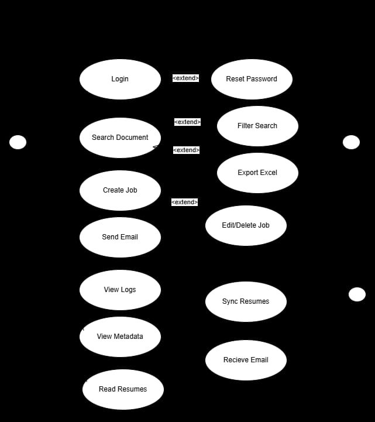
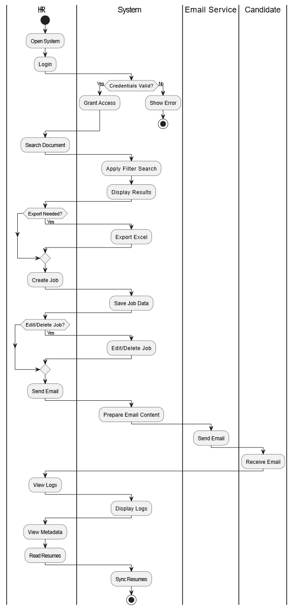
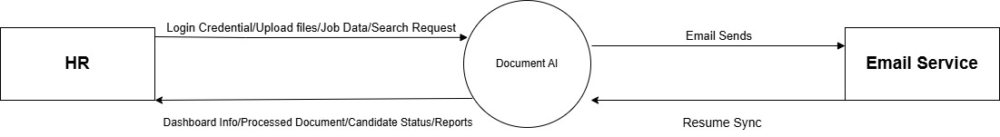
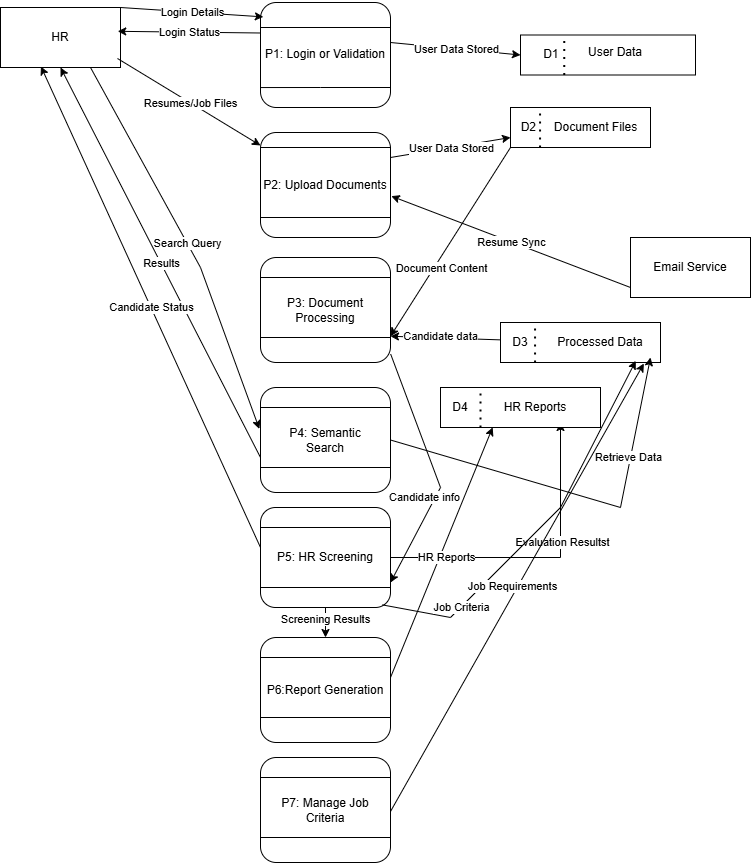

# Introduction

## Purpose

The project is intended to help organizations in effectively managing, searching, and extracting meaningful information from large and unstructured collection of documents. Manual document review and resume screening processes are time-consuming, error-prone, and inefficient. This project aims to reduce human effort and operational delays by introducing an automated solution that enhances document understanding and information retrieval. By leveraging artificial intelligence techniques, the system seeks to improve accuracy, consistency, and speed in document analysis and HR decision-making processes.

Additionally, the project is proposed to support automated documentation. The system serves as a foundation for scalable AI-driven documentation that can be applied to a variety of organizational domains, such as management and recruitment.

## Project Scope

The problem that most businesses face when trying to manage and gain insight from large collections of documents is addressed by the AI-Powered HR Screening and Document Retrieval System Using RAG. The time-consuming manual review of documents is eliminated by the system, which also provides a capable system for document comprehension and analysis.

### Key Capabilities

**Comprehensive Document Analysis Through Automated Processing**

- PDF files
- Microsoft Word documents
- Scanned images

**Optical Character Recognition (OCR) Technology**

Extract readable text from scanned and image-based documents:

- Documents are classified by type
- Documents are tagged with relevant metadata
- Documents are converted into vector embeddings for semantic search

**Natural Language Interface**

- Search documents using plain English queries
- Ask questions related to document content

**Retrieval-Augmented Generation (RAG)**

- Retrieves relevant document content based on the user's query
- Uses semantic search with vector embeddings
- Provides factual context from stored documents to the AI model
- Generates accurate, context-aware responses grounded in source data
- Reduces incorrect or irrelevant AI-generated answers
- Supports reliable question answering for HR and document analysis tasks

### HR Resume Screening

- Assists HR personnel in resume screening and candidate shortlisting
- Collects resume attachments from incoming emails
- Processes multiple resume formats
- Extracts candidate information such as:
  - Skills
  - Educational qualifications
  - Work experience
  - Contact details
- Matches and ranks candidates against:
  - Predefined job descriptions
  - Required skills and experience criteria
- Significantly reduces:
  - Manual resume screening effort
  - HR workload and processing time

### Benefits

- Application will improve operational efficiency by reducing manual document processing
- Application will minimize human error in document review and analysis
- Application will enhance productivity across departments such as HR and knowledge management

### Objectives

- To streamline repetitive document review and classification tasks
- To provide automation (powered by AI) for HR screening and compliance monitoring
- To Improve accessibility and management of organizational knowledge

### Strategic Alignment

The system is designed to support the use of AI Powered automation for improving document retrieval and resume screening tasks. It provides a practical implementation of AI-based document search and analysis that can be adapted to different types of organizational documents. The system is intended to handle moderate document volumes and may be extended in future to support larger datasets as per organizational requirements.

### Out of Scope

This release does not include integration with third-party applicant tracking systems (i.e. indeed, greenhouse), nor does it support the processing of video or audio file formats. Native mobile applications for iOS and Android platforms are planned for future releases and are therefore not covered within the scope of this specification.

## References

The following documents and resources were consulted during the preparation of this SRS:

1. Google Cloud Documentation - Document AI Overview
   <https://cloud.google.com/document-ai>

2. Amazon Web Services - Amazon Textract: Extract Text and Data from Documents
   <https://aws.amazon.com/textract>

3. Microsoft Azure - Form Recognizer Documentation
   <https://azure.microsoft.com/en-us/products/form-recognizer>

4. LangChain Documentation - Building Applications with Retrieval-Augmented Generation (RAG)
   <https://python.langchain.com>

5. Hugging Face - Document AI: Understanding Documents with Transformers
   <https://huggingface.co/blog/document-ai>

6. Hugging Face - Transformers and Large Language Models Documentation
   <https://huggingface.co/docs>

7. PyMuPDF Documentation - Working with PDFs in Python
   <https://pymupdf.readthedocs.io>

8. FAISS - Facebook AI Similarity Search Library
   <https://faiss.ai>

9. Tesseract OCR - Optical Character Recognition Engine
   <https://github.com/tesseract-ocr/tesseract>

10. IEEE Standard 830-1998 - IEEE Recommended Practice for Software Requirements Specification

# Overall Description

## Product Perspective

The AI-Powered HR Screening and Document Retrieval System Using RAG is a new, self-contained product designed to address the growing need for intelligent document processing solutions. The system provides advanced AI capabilities including semantic search, automated extraction, and intelligent question answering.

### System Context

The system functions as a standalone document processing and analysis platform that can integrate with existing enterprise tools and workflows. It is designed to complement rather than replace existing content management systems by providing AI-based search and analysis features that traditional systems typically do not support.

### Major System Components

The system architecture consists of several interconnected components working together to deliver comprehensive document intelligence:

| Component                    | Description                                                                        |
| ---------------------------- | ---------------------------------------------------------------------------------- |
| **Document Ingestion Layer** | Handles file uploads, format validation, and initial document routing              |
| **Processing Engine**        | Performs OCR, text extraction, classification, and metadata generation             |
| **AI/NLP Module**            | Generates vector embeddings, executes semantic search, and powers the RAG pipeline |
| **Vector Database**          | Stores document embeddings and enables efficient similarity-based retrieval        |
| **HR Automation Module**     | Manages Gmail integration, resume collection, and candidate shortlisting           |
| **Backend API Layer**        | Coordinates all system operations and handles business logic                       |
| **Frontend Interface**       | Provides user-facing web application for all system interactions                   |
| **Security Layer**           | Implements authentication, authorization, and data protection mechanisms           |

### External Interfaces

The system interfaces with Gmail (i.e. hr specific email) for automated resume collection in the HR module. All email integration occurs through secure OAuth authentication without storing credentials. Future versions may also include interfaces to enterprise resource planning (ERP) systems and document management platforms.

### Hardware Platform

The system is designed to run on standard server hardware or private cloud instances. Client devices access the system through standard web browsers without requiring any software installation.

## Product Features

The system provides a comprehensive suite of features organized into functional modules:

### Document Processing and Management

Users can upload various document formats including PDF, Word documents, and scanned images through an intuitive drag-and-drop interface supporting batch uploads. The system automatically processes each document through OCR for text extraction, classifies documents by type such as resumes, reports, contracts, or letters, generates structured metadata including document type, date, author, and relevant attributes, and stores all information in searchable format. A centralized dashboard provides visibility into all processed documents with capabilities for sorting, filtering, preview, download, and deletion.

### Intelligent Search and Retrieval

The semantic search engine allows users to find information using natural language queries rather than exact keyword matching. Vector embeddings enable retrieval based on conceptual similarity and meaning. Users can filter search results by document type, date range, or other metadata attributes. The system presents ranked results showing the most relevant documents and text segments with highlighted matches and contextual snippets.

### Question Answering System

Using Retrieval-Augmented Generation technology, the system provides context-aware answers to user questions about uploaded documents. Users interact through a conversational chat interface asking questions in natural language. The system retrieves relevant content from the document collection and generates concise, accurate responses.

**Example queries:**

- "Extract skills from candidate John's resume"
- "Summarize the findings in the Q3 report"
- "What are the key terms in this contract?"

### Resume Screening

HR personnel create and save job descriptions defining required skills, education levels, experience requirements, and other criteria. The HR module connects securely to organizational Gmail accounts through OAuth authentication. It automatically syncs and collects resume attachments from incoming emails, maintaining a complete history of collected resumes. The module also supports sending follow-up emails or digital forms to selected candidates.

### Integration and Automation

A well-defined API layer facilitates integration with external applications and automated workflows. For instance, résumés received via email can trigger automated processing pipelines. Processed results can be shared with HR management systems or reporting tools through dedicated API endpoints.

### Privacy and Security

The system implements role-based access control, secure authentication mechanisms, activity logging, and audit trails to maintain data security and privacy compliance.

## User Classes and Characteristics

### HR Personnel

HR staff members use the system primarily for resume screening and candidate management. They possess moderate technical skills and familiarity with recruitment workflows and applicant tracking concepts. This user class requires specific features for connecting email accounts, defining job descriptions, reviewing candidate information, and managing shortlists. They need the ability to export candidate data and communicate with applicants. HR personnel are frequent users during active recruitment cycles and occasional users during other periods. The system must streamline their workflow and significantly reduce the time spent on manual resume review.

### Email Service

The Email Service is an external, non-human system that enables automated email-based recruitment workflows in the HR module of the project. It connects securely to organizational email accounts using OAuth 2.0, allowing the system to access incoming resumes and send recruitment-related messages such as interview invitations or rejection notifications. Operating as a background service, it performs predefined communication tasks without independent decision-making, ensuring reliable synchronization of resumes and secure email transfer while reducing manual effort for HR personnel.

## Operating Environment

### Server Environment

- The system can be deployed on Linux-based servers (Ubuntu 20.04 LTS or higher, CentOS 8 or higher) or Windows Server 2019 or higher
- Minimum hardware requirements include:
  - 16 GB RAM (32 GB recommended for optimal performance)
  - Quad-core processor (eight-core recommended)
  - At least 500 GB storage, with SSD preferred for database and document storage

### Software Dependencies

- The system requires Python 3.9 or higher as the primary runtime environment
- A relational database such as PostgreSQL 13 or higher is used for metadata and user data storage
- A vector database is used for embedding storage and semantic search, such as:
  - FAISS (Facebook AI Similarity Search)
  - Weaviate
  - Chroma
- Additional software dependencies include:
  - OCR libraries for text extraction
  - NLP frameworks for document processing
  - Web frameworks for API and frontend services
  - Containerization tools such as Docker for deployment and scalability

### Client Environment

- Users access the system through modern web browsers, including:
  - Google Chrome (version 90 or higher)
  - Mozilla Firefox (version 88 or higher)
  - Microsoft Edge (version 90 or higher)
  - Safari (version 14 or higher)
- JavaScript must be enabled in the browser
- A stable internet or intranet connection is required
- No additional plugins or software installations are required on client devices
- The user interface is responsive and adapts to various screen sizes, including desktop monitors and tablets

### Network Environment

- The system requires secure network connectivity between server components and client devices
- For the HR module, outbound HTTPS connections to Gmail servers are required for email integration
- The system supports deployment behind firewalls with appropriate port configurations
- All communication between clients and servers is conducted using encrypted HTTPS connections

### Integration Environment

- The system integrates with Gmail services using OAuth 2.0 for the HR resume collection feature
- It integrates with organizational LDAP or Active Directory services for centralized user authentication
- Future integrations may include document management systems, enterprise resource planning platforms, or other business applications via RESTful APIs

## Design and Implementation Constraints

### Privacy and Security Constraints

- The system must implement appropriate security measures to protect sensitive information
- Data encryption must be applied both at rest and in transit
- Audit trails must be maintained for all data access and processing activities
- Role-based access control (RBAC) must be supported to restrict functionality based on user privileges
- All data storage and processing must comply with relevant data protection regulations, including GDPR, CCPA, and local privacy laws as applicable to the deployment location

### Technology and Tool Constraints

- The system should use modular, replaceable components to minimize vendor lock-in
- AI models must be deployable on available infrastructure, including cloud-based or locally-hosted options based on organizational requirements
- The system should support CPU-only and GPU-accelerated deployments to accommodate varying hardware availability

### Performance Constraints

| Metric                 | Requirement                                                       |
| ---------------------- | ----------------------------------------------------------------- |
| OCR Processing         | Complete within 30 seconds for a standard document                |
| Search Queries         | Return results within 2 seconds for typical document collections  |
| RAG Question Answering | Generate responses within 10 seconds                              |
| Concurrent Users       | Handle multiple users without significant performance degradation |
| Document Capacity      | Support at least 100,000 documents in initial deployment          |

### Interface Constraints

- The Gmail integration for HR resume collection must use official OAuth 2.0 authentication and comply with Gmail API usage policies and rate limits
- The web interface must be accessible and fully usable without requiring installation of special software or browser plugins
- The system must provide clear error messages and guidance when processing fails or produces unexpected results

### Regulatory and Policy Constraints

- The system must not violate copyright or intellectual property rights when processing and analyzing documents
- Organizations deploying the system are responsible for ensuring they have appropriate rights to process uploaded documents
- The system must maintain separation between different users' data and enforce appropriate access controls
- Any AI-generated content must be clearly identified to prevent misrepresentation

## User Documentation

The following documentation will be delivered with the system:

### Installation and Deployment Guide

- The system shall be deployable on both Linux and Windows servers, using Docker-based or manual installation methods
- The system shall require standard hardware resources and support optional GPU acceleration for AI processing
- The system shall use open-source, self-hosted components, including backend, frontend, OCR, and AI modules
- The system shall include a relational database for metadata and a vector database for semantic search and retrieval
- The system shall support automated OCR, Retrieval-Augmented Generation (RAG) for question answering, email-based HR resume ingestion, and role-based access control

### HR Module User Guide

- The system shall provide specialized documentation for HR personnel explaining the use of the automated resume screening module
- The documentation shall cover Gmail account connection, resume collection, and synchronization procedures
- The documentation shall explain how to create, update, and manage job descriptions and screening criteria
- The documentation shall guide HR users in reviewing extracted candidate information and using AI-based shortlisting features
- The documentation shall include instructions for exporting shortlisted candidate data and communicating with applicants
- The documentation shall provide workflow examples and best practices to ensure effective and consistent resume screening

### API Documentation

- The system shall provide technical documentation for developers to support system integration and feature extension
- The documentation shall include API endpoint descriptions, along with supported operations and parameters
- The documentation shall define request and response formats, including data structures and validation rules
- The documentation shall specify authentication mechanisms, authorization requirements, and access controls
- The documentation shall document error codes, error messages, and recommended handling procedures
- The system shall generate API documentation automatically using Swagger/OpenAPI based on in-code annotations and provide example usage for multiple programming languages

### Quick Start Guide

- The system shall provide a condensed quick reference guide to help new users start using the system efficiently
- The guide shall cover common tasks and core workflows, including document upload, search, and question answering
- The guide shall present instructions in a simplified, step-by-step format for ease of understanding
- The guide shall be designed in a print-friendly format suitable for use as a reference card
- The guide shall enable users to perform basic system operations without requiring detailed technical knowledge

### Video Tutorials

- The system shall provide short instructional videos demonstrating key system workflows
- The videos shall cover document upload, semantic search, question answering, and HR module setup
- The videos shall present workflows in a clear, step-by-step manner for easy user understanding
- The videos shall be accessible within the system interface or available as downloadable files
- The videos shall support user training and onboarding without requiring extensive written documentation

### Release Notes

- The system shall provide release documentation for each system version
- The release notes shall describe new features, enhancements, and resolved issues
- The release notes shall list known issues and limitations, if any
- The release notes shall include upgrade and deployment instructions where applicable
- The release documentation shall be maintained and updated throughout the project lifecycle

## Assumptions and Dependencies

### Technical Assumptions

- The system will be deployed on hardware with sufficient CPU, memory, and storage resources
- GPU hardware may be available to improve performance, but the system will remain functional on CPU-only machines
- A stable local network connection will be available for communication between system components
- Internet connectivity will be sufficient for email integration features in the HR module
- Standard Python runtime environments and commonly used libraries will remain compatible throughout development and deployment

### AI and NLP Model Assumptions

- Suitable language and embedding models will be available for local deployment
- OCR technology will provide acceptable accuracy for standard printed documents
- Document quality will affect extraction accuracy, especially for scanned or handwritten files
- Retrieval-augmented generation will return relevant and context-aware answers for most queries

### Organizational Assumptions

- Organizations will provide administrative support for system setup and maintenance
- Users will have basic computer and web application usage skills
- Backup and recovery procedures will be implemented by the deploying organization
- HR departments will define clear job requirements for effective candidate evaluation

### Dependencies

- The project depends on the continued availability of Python and its supporting ecosystem
- OCR, NLP, and vector storage libraries must remain actively maintained and compatible
- Web frameworks and containerization tools will be available for deployment
- The HR module depends on Gmail API access and OAuth 2.0 authentication services
- Development depends on access to suitable test documents and datasets
- Progress and quality depend on continuous academic supervision and feedback
- Long-term system maintenance depends on trained personnel and documentation availability

# System Features

## User Authentication and Access Control

### Description

This feature provides secure user authentication and role-based access control to ensure that only authorized users can access system functionalities appropriate to their roles.

### Actors

- HR Personnel

### Functional Requirements

**REQ-3.1.1: User Login Authentication**

The system shall allow users to log in using registered email and password credentials.

_Use Case Reference: UC-1 – Login_

**REQ-3.1.2: Password Reset Functionality**

The system shall allow users to reset their password using a secure verification mechanism.

_Use Case Reference: UC-2 – Reset Password_

**REQ-3.1.3: Access Restriction for Unauthenticated Users**

The system shall restrict access to system features unless the user is successfully authenticated.

_Use Case Reference: UC-1 – Login_

## Document Upload and Processing

### Description

This feature allows HR users to upload documents and automatically process them for further analysis.

### Actors

- HR Personnel

### Functional Requirements

**REQ-3.2.1: Document Upload**

The system shall allow HR users to upload files such as resumes and HR documents.

_Use Case Reference: UC-3 – Upload Files_

**REQ-3.2.2: Text Extraction from Documents**

The system shall extract text from uploaded documents using OCR when required.

_Use Case Reference: UC-4 – Process Document_

**REQ-3.2.3: Secure Document Storage**

The system shall store uploaded documents along with extracted text for future retrieval.

_Use Case Reference: UC-3 – Upload Files_

## Search Document

### Description

This feature enables users to search documents and refine results using filters.

### Actors

- HR Personnel

### Functional Requirements

**REQ-3.3.1: Keyword and Natural Language Document Search**

The system shall allow users to search documents using keywords or natural language queries.

_Use Case Reference: UC-5 – Search_

**REQ-3.3.2: Search Functionality**

The system shall allow users to search results based on criteria such as skills, job role, or date.

_Use Case Reference: UC-5 – Search_

**REQ-3.3.3: Relevance Based Search Result Ranking**

The system shall display ranked search results based on relevance.

_Use Case Reference: UC-5 – Search_

## Filter Document

### Description

This feature enables HR users to create and manage job postings for resume screening.

### Actors

- HR Personnel

### Functional Requirements

**REQ-3.4.1: Document Filter Functionality**

The system shall allow users to filter documents based on criteria such as skills, job role, or date.

_Use Case Reference: UC-6 – Filter Document_

## Job Creation and Management

### Description

This feature enables HR users to create and manage job postings for resume screening.

### Actors

- HR Personnel

### Functional Requirements

**REQ-3.4.1: Job Description Creation**

The system shall allow HR users to create job descriptions with required criteria.

_Use Case Reference: UC-7 – Create Job_

**REQ-3.4.2: Job Posting Editing**

The system shall allow HR users to edit existing job postings.

_Use Case Reference: UC-8 – Edit Job_

## Resume Viewing and Candidate Screening

### Description

This feature enables HR users to review resumes and perform candidate shortlisting.

### Actors

- HR Personnel

### Functional Requirements

**REQ-3.5.1: View Resume**

The system shall allow HR users to view and read extracted resume content.

_Use Case Reference: UC-10 – View Resume_

**REQ-3.5.2: Shortlist Candidate**

The system shall allow HR users to shortlist candidates based on job relevance.

_Use Case Reference: UC-11 – Shortlist Candidate_

**REQ-3.5.3: Reject Candidate**

The system shall allow HR users to reject candidates.

_Use Case Reference: UC-12 – Reject Candidate_

**REQ-3.5.4: Export Shortlisted Candidates to Excel**

The system shall allow HR users to export shortlisted candidates to Excel format.

_Use Case Reference: UC-13 – Export Excel_

## Email Integration and Resume Synchronization

### Description

This feature integrates the system with email services to automate resume collection and communication.

### Actors

- HR Personnel
- Email Service

### Functional Requirements

**REQ-3.6.1: Connect Email**

The system shall allow HR users to connect their email account securely.

_Use Case Reference: UC-14 – Connect Email_

**REQ-3.6.2: Sync Resume from Email**

The system shall automatically sync resume attachments from connected email accounts.

_Use Case Reference: UC-15 – Sync Resume_

**REQ-3.6.3: Send Email to Candidate**

The system shall allow HR users to send emails to candidates.

_Use Case Reference: UC-16 – Send Email_

## Logs and Metadata Management

### Description

This feature provides transparency and traceability of system activities and document data.

### Actors

- HR Personnel

### Functional Requirements

**REQ-3.7.1: View System Activity Logs**

The system shall allow users to view system activity logs.

_Use Case Reference: UC-17 – View Logs_

**REQ-3.7.2: View Document Metadata**

The system shall allow users to view extracted document metadata such as skills and experience.

_Use Case Reference: UC-18 – View Metadata_

# Use Cases

## UC-01: Login

| Field                        | Description                                                                            |
| ---------------------------- | -------------------------------------------------------------------------------------- |
| **Use Case #**               | UC-01                                                                                  |
| **Context of Use**           | HR user logs in to access the Document AI system                                       |
| **Scope**                    | User Authentication                                                                    |
| **Primary Actor**            | HR                                                                                     |
| **Stakeholders & Interests** | HR – secure access to system                                                           |
| **Pre-Conditions**           | 1. System is running 2. User is registered                                             |
| **Trigger**                  | HR selects Login                                                                       |
| **Main Course**              | 1. Open Login Page 2. Enter email and password 3. Validate credentials 4. Grant access |
| **Post-Conditions**          | User redirected to dashboard                                                           |
| **Failure Protection**       | Invalid credentials block access                                                       |
| **Extensions**               | UC-02 Reset Password                                                                   |
| **Open Issues**              | Account lock after multiple failures                                                   |
| **References**               | Use Case Diagram                                                                       |

## UC-02: Reset Password

| Field                        | Description                                           |
| ---------------------------- | ----------------------------------------------------- |
| **Use Case #**               | UC-02                                                 |
| **Context of Use**           | User resets forgotten password                        |
| **Scope**                    | User Authentication                                   |
| **Primary Actor**            | HR                                                    |
| **Stakeholders & Interests** | HR – account recovery                                 |
| **Pre-Conditions**           | User email exists                                     |
| **Trigger**                  | User clicks "Reset Password"                          |
| **Main Course**              | 1. Enter email 2. Verify identity 3. Set new password |
| **Post-Conditions**          | Password updated                                      |
| **Failure Protection**       | Invalid email rejected                                |
| **Extensions**               | Verification timeout                                  |
| **Open Issues**              | Password policy                                       |
| **References**               | Use Case Diagram                                      |

## UC-03: Search Documents

| Field                        | Description                                              |
| ---------------------------- | -------------------------------------------------------- |
| **Use Case #**               | UC-03                                                    |
| **Context of Use**           | HR searches stored documents                             |
| **Scope**                    | Document Retrieval                                       |
| **Primary Actor**            | HR                                                       |
| **Stakeholders & Interests** | HR – fast document access                                |
| **Pre-Conditions**           | Documents exist                                          |
| **Trigger**                  | HR enters search query                                   |
| **Main Course**              | 1. Enter keywords 2. Search documents 3. Display results |
| **Post-Conditions**          | Matching documents shown                                 |
| **Failure Protection**       | No results handled                                       |
| **Extensions**               | UC-04 Filter Search, UC-05 Export Excel                  |
| **Open Issues**              | Ranking logic                                            |
| **References**               | Use Case Diagram                                         |

## UC-04: Filter Search

| Field                        | Description                         |
| ---------------------------- | ----------------------------------- |
| **Use Case #**               | UC-04                               |
| **Context of Use**           | HR refines search results           |
| **Scope**                    | Search Filtering                    |
| **Primary Actor**            | HR                                  |
| **Stakeholders & Interests** | HR – accurate results               |
| **Pre-Conditions**           | Search performed                    |
| **Trigger**                  | HR selects filters                  |
| **Main Course**              | 1. Choose filters 2. Apply criteria |
| **Post-Conditions**          | Filtered results displayed          |
| **Failure Protection**       | Invalid filters ignored             |
| **Extensions**               | Multi-filter selection              |
| **Open Issues**              | Filter performance                  |
| **References**               | Use Case Diagram                    |

## UC-05: Export Excel

| Field                        | Description                                    |
| ---------------------------- | ---------------------------------------------- |
| **Use Case #**               | UC-05                                          |
| **Context of Use**           | HR exports search results                      |
| **Scope**                    | Data Export                                    |
| **Primary Actor**            | HR                                             |
| **Stakeholders & Interests** | HR – offline analysis                          |
| **Pre-Conditions**           | Search results available                       |
| **Trigger**                  | HR selects Export                              |
| **Main Course**              | 1. Select export option 2. Generate Excel file |
| **Post-Conditions**          | Excel downloaded                               |
| **Failure Protection**       | Export failure handled                         |
| **Extensions**               | Custom fields                                  |
| **Open Issues**              | File size limits                               |
| **References**               | Use Case Diagram                               |

## UC-06: Create Job

| Field                        | Description                      |
| ---------------------------- | -------------------------------- |
| **Use Case #**               | UC-06                            |
| **Context of Use**           | HR creates job opening           |
| **Scope**                    | Job Management                   |
| **Primary Actor**            | HR                               |
| **Stakeholders & Interests** | HR – job posting                 |
| **Pre-Conditions**           | User logged in                   |
| **Trigger**                  | HR selects Create Job            |
| **Main Course**              | 1. Enter job details 2. Save job |
| **Post-Conditions**          | Job created                      |
| **Failure Protection**       | Invalid data blocked             |
| **Extensions**               | UC-07 Edit/Delete Job            |
| **Open Issues**              | Job template                     |
| **References**               | Use Case Diagram                 |

## UC-07: Edit/Delete Job

| Field                        | Description                     |
| ---------------------------- | ------------------------------- |
| **Use Case #**               | UC-07                           |
| **Context of Use**           | HR updates job information      |
| **Scope**                    | Job Management                  |
| **Primary Actor**            | HR                              |
| **Stakeholders & Interests** | HR – job accuracy               |
| **Pre-Conditions**           | Job exists                      |
| **Trigger**                  | HR selects edit/delete          |
| **Main Course**              | 1. Modify Job 2. Save or delete |
| **Post-Conditions**          | Job updated                     |
| **Failure Protection**       | Unauthorized action blocked     |
| **Extensions**               | Job history                     |
| **Open Issues**              | Audit trail                     |
| **References**               | Use Case Diagram                |

## UC-08: Send Email

| Field                        | Description                                |
| ---------------------------- | ------------------------------------------ |
| **Use Case #**               | UC-08                                      |
| **Context of Use**           | HR sends emails to candidates              |
| **Scope**                    | Communication                              |
| **Primary Actor**            | HR                                         |
| **Secondary Actor**          | Email Service                              |
| **Stakeholders & Interests** | HR – candidate communication               |
| **Pre-Conditions**           | Email service connected                    |
| **Trigger**                  | HR selects Send Email                      |
| **Main Course**              | 1. Compose email 2. Send via email service |
| **Post-Conditions**          | Email delivered                            |
| **Failure Protection**       | Retry mechanism                            |
| **Extensions**               | Attach documents                           |
| **Open Issues**              | Email templates                            |
| **References**               | Use Case Diagram                           |

## UC-09: Receive Email

| Field                        | Description                                              |
| ---------------------------- | -------------------------------------------------------- |
| **Use Case #**               | UC-09                                                    |
| **Context of Use**           | System receives resumes via email                        |
| **Scope**                    | Candidate                                                |
| **Primary Actor**            | Email Service                                            |
| **Secondary Actor**          | System                                                   |
| **Stakeholders & Interests** | HR – automated resume intake                             |
| **Pre-Conditions**           | Email integration enabled                                |
| **Trigger**                  | Incoming email                                           |
| **Main Course**              | 1. Receive email 2. Extract attachments 3. Store resumes |
| **Post-Conditions**          | Resume added to system                                   |
| **Failure Protection**       | Invalid attachment ignored                               |
| **Extensions**               | Multiple attachments                                     |
| **Open Issues**              | Spam handling                                            |
| **References**               | Use Case Diagram                                         |

## UC-10: Sync Resumes

| Field                        | Description                        |
| ---------------------------- | ---------------------------------- |
| **Use Case #**               | UC-10                              |
| **Context of Use**           | System syncs resumes from email    |
| **Scope**                    | Resume Synchronization             |
| **Primary Actor**            | Email Service                      |
| **Stakeholders & Interests** | HR – updated data                  |
| **Pre-Conditions**           | New emails received                |
| **Trigger**                  | Sync scheduled                     |
| **Main Course**              | 1. Fetch emails 2. Process resumes |
| **Post-Conditions**          | Resumes indexed                    |
| **Failure Protection**       | Duplicate check                    |
| **Extensions**               | Manual sync                        |
| **Open Issues**              | Sync frequency                     |
| **References**               | Use Case Diagram                   |

## UC-11: View Logs

| Field                        | Description                         |
| ---------------------------- | ----------------------------------- |
| **Use Case #**               | UC-11                               |
| **Context of Use**           | HR reviews system activity          |
| **Scope**                    | Logging                             |
| **Primary Actor**            | HR                                  |
| **Stakeholders & Interests** | HR – auditing                       |
| **Pre-Conditions**           | Logs exist                          |
| **Trigger**                  | HR selects View Logs                |
| **Main Course**              | 1. Retrieve logs 2. Display entries |
| **Post-Conditions**          | Logs shown                          |
| **Failure Protection**       | Empty logs handled                  |
| **Extensions**               | Filter logs                         |
| **Open Issues**              | Log retention                       |
| **References**               | Use Case Diagram                    |

## UC-12: View Metadata

| Field                        | Description                       |
| ---------------------------- | --------------------------------- |
| **Use Case #**               | UC-12                             |
| **Context of Use**           | HR views document metadata        |
| **Scope**                    | Metadata Management               |
| **Primary Actor**            | HR                                |
| **Stakeholders & Interests** | HR – document insight             |
| **Pre-Conditions**           | Document exists                   |
| **Trigger**                  | Select View Metadata              |
| **Main Course**              | 1. Fetch metadata 2. Display info |
| **Post-Conditions**          | Metadata shown                    |
| **Failure Protection**       | Missing metadata handled          |
| **Extensions**               | Metadata edit                     |
| **Open Issues**              | Standard fields                   |
| **References**               | Use Case Diagram                  |

## UC-13: Read Resumes

| Field                        | Description                       |
| ---------------------------- | --------------------------------- |
| **Use Case #**               | UC-13                             |
| **Context of Use**           | HR reads resume content           |
| **Scope**                    | Resume Analysis                   |
| **Primary Actor**            | HR                                |
| **Stakeholders & Interests** | HR – candidate review             |
| **Pre-Conditions**           | Resume processed                  |
| **Trigger**                  | Select resume                     |
| **Main Course**              | 1. Load resume 2. Display content |
| **Post-Conditions**          | Resume displayed                  |
| **Failure Protection**       | OCR fallback                      |
| **Extensions**               | Highlight skills                  |
| **Open Issues**              | Formatting                        |
| **References**               | Use Case Diagram                  |

# Diagrams

## Use Case Diagram

## Activity Diagram

### DFD Diagrams

### Level 0

### Level 1

### Level 2

