# Introduction

## Project Overview

- **Project:** AI-Powered HR Screening and Document Retrieval System
- **Technology:** Retrieval-Augmented Generation (RAG)
- **Domain:** Human Resources & Document Management
- **Primary Users:** HR Personnel

## Purpose

The project helps organizations in:

- Managing large collections of unstructured documents
- Searching and extracting meaningful information using AI
- Automating resume screening and candidate evaluation
- Reducing time-consuming manual document review

## Project Scope

::: {.columns}
::: {.column width="50%"}
**Document Processing**

- PDF, Word, and scanned images
- OCR-based text extraction
- Automatic document classification
- Metadata generation and tagging
:::

::: {.column width="50%"}
**HR Screening**

- Gmail integration for resume collection
- Multiple resume format support
- Candidate ranking against job criteria
- Shortlisting and export capabilities
:::
:::

# Existing System

## Current Approaches

| Approach | Method | Limitation |
|----------|--------|------------|
| Manual Review | Human effort | Time-consuming, error-prone |
| Keyword Search | Exact text matching | Misses semantically similar content |
| Traditional ATS | Rule-based filtering | Rigid criteria, misses good candidates |
| Basic OCR Tools | Text extraction only | No intelligent analysis |

## Related Technologies

| Technology | Category | Year |
|------------|----------|------|
| LangChain | RAG Framework | 2022 |
| FAISS | Vector Similarity Search | 2017 |
| ChromaDB | Vector Database | 2022 |
| Eightfold AI | AI Recruitment | 2016 |
| Greenhouse | ATS, Resume Filtering | 2012 |
| Google Document AI | Document Processing | 2020 |
| Amazon Textract | Text Extraction | 2018 |
| Tesseract | Open-source OCR | 2006 |

## Limitations of Existing Systems

::: {.columns}
::: {.column width="50%"}
**Technical Limitations**

- Cannot understand document context
- No natural language question answering
- Keyword-based search only
- Limited to specific file formats
:::

::: {.column width="50%"}
**Practical Limitations**

- Document and HR tools are separate
- Still requires significant manual review
- No unified platform for both needs
- Poor handling of unstructured data
:::
:::

# Problem Statement

## Core Problems

::: {.columns}
::: {.column width="50%"}
**Document Management**

- Large document collections are hard to manage
- Difficult to search without exact keywords
- Manual classification is tedious
- No way to ask questions about content
:::

::: {.column width="50%"}
**HR Screening**

- Resume screening is time-consuming
- Good candidates are often overlooked
- Manual email collection is tedious
- No automated candidate ranking
:::
:::

## Challenges Addressed

| Challenge | Impact |
|-----------|--------|
| Large document volumes | Difficult to find relevant information |
| Keyword-based search limitations | Semantically similar content is missed |
| No question answering capability | Users cannot query document content |
| Manual resume collection | HR spends time on repetitive tasks |
| Subjective candidate evaluation | Inconsistent screening decisions |

# Proposed System

## Solution Overview

An AI-powered system that combines document management with HR screening:

- **Document Processing:** Automated text extraction, classification, and tagging
- **Semantic Search:** Find documents by meaning, not just keywords
- **RAG Module:** Ask questions and get AI-generated answers from documents
- **HR Screening:** Automated resume collection, parsing, and candidate ranking

## Key Capabilities

::: {.columns}
::: {.column width="50%"}
**Document Features**

- Upload PDF, Word, images
- OCR for scanned documents
- Automatic classification
- Metadata extraction
- Natural language search
:::

::: {.column width="50%"}
**HR Features**

- Gmail OAuth integration
- Resume attachment sync
- Skill and experience extraction
- Job-based candidate matching
- Shortlist and export to Excel
:::
:::

## How RAG Works

1. **Upload:** Documents are added to the system
2. **Extract:** Text is extracted using OCR when needed
3. **Chunk:** Content is split into meaningful sections
4. **Embed:** Text chunks are converted to vector embeddings
5. **Query:** User asks a question in natural language
6. **Retrieve:** System finds semantically relevant chunks
7. **Generate:** AI produces an answer based on retrieved content

## System Features Summary

| Feature | Description |
|---------|-------------|
| User Authentication | Login, password reset, role-based access |
| Document Upload | PDF, Word, image upload with processing |
| Search & Filter | Semantic search with metadata filters |
| RAG Q&A | Natural language questions over documents |
| Job Management | Create, edit, delete job postings |
| Resume Screening | View, shortlist, reject candidates |
| Email Integration | Gmail sync for resume collection |
| Activity Logs | Audit trail of system activities |

# Methodology

## System Architecture

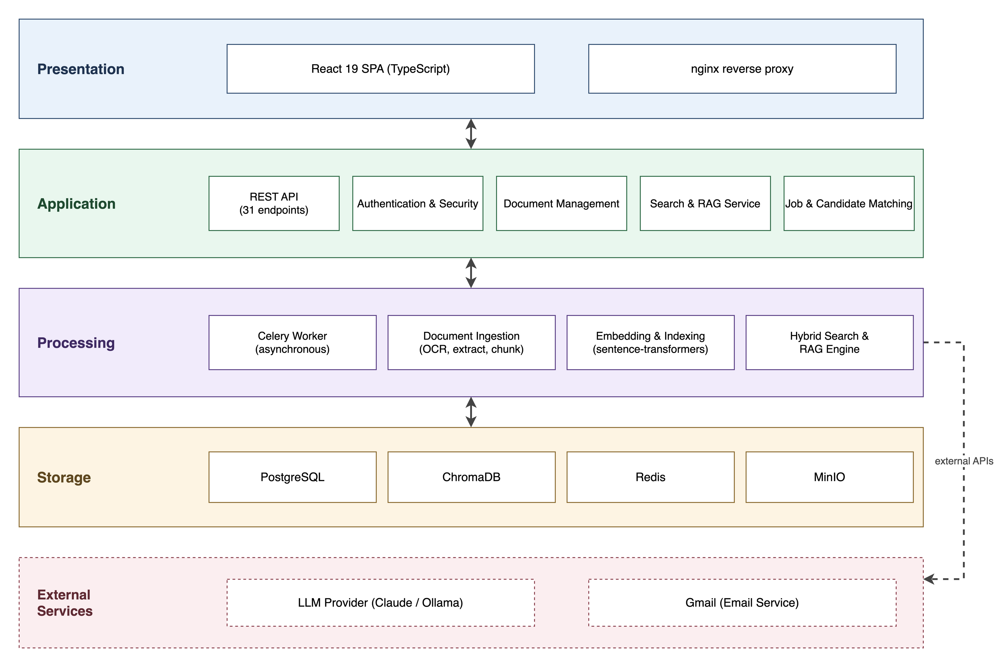{width=10in}

## Major Components

| Component | Description |
|-----------|-------------|
| Document Ingestion | File uploads, format validation, routing |
| Processing Engine | OCR, text extraction, classification |
| AI/NLP Module | Embeddings, semantic search, RAG |
| Vector Database | Document embeddings for similarity search |
| HR Module | Gmail integration, resume collection, screening |
| Backend API | Business logic and coordination |
| Frontend Interface | Web application for user interactions |
| Security Layer | Authentication, authorization, audit |

## Development Approach

::: {.columns}
::: {.column width="50%"}
**Phase 1: Planning**

- Requirements gathering
- System architecture design
- Database schema design
- User interface planning
:::

::: {.column width="50%"}
**Phase 2: Implementation**

- Backend API development
- AI/RAG component setup
- Frontend development
- Integration and testing
:::
:::

## Data Flow

::: {.columns}
::: {.column width="50%"}
**Document Processing Flow**

1. User uploads document
2. System extracts text (OCR if needed)
3. Document is classified
4. Metadata is generated
5. Content is indexed for search
:::

::: {.column width="50%"}
**Search & Q&A Flow**

1. User enters query
2. Query is parsed for intent
3. Relevant content is retrieved
4. Results are ranked
5. AI generates response
:::
:::

# Tools and Techniques

## Backend Technologies

| Tool | Purpose |
|------|---------|
| Python 3.9+ | Primary programming language |
| FastAPI | Backend web framework |
| PostgreSQL 13+ | Relational database for metadata |
| ChromaDB | Vector database for embeddings |
| LangChain | RAG framework and LLM orchestration |
| Tesseract OCR | Text extraction from images |
| PyMuPDF | PDF processing |

## AI and NLP Technologies

| Technology | Purpose |
|------------|---------|
| OpenAI Embeddings | Text-to-vector conversion |
| Large Language Models | Answer generation and parsing |
| Semantic Search | Meaning-based document retrieval |
| Section Detection | Resume parsing with regex + LLM |

## Frontend and Infrastructure

| Tool | Purpose |
|------|---------|
| React / Next.js | Frontend web framework |
| OAuth 2.0 | Gmail authentication |
| Docker | Containerized deployment |
| HTTPS | Secure communication |

## Operating Environment

::: {.columns}
::: {.column width="50%"}
**Server Requirements**

- Linux (Ubuntu 20.04+) or Windows Server
- 16 GB RAM minimum
- Quad-core processor
- 500 GB SSD storage
:::

::: {.column width="50%"}
**Client Requirements**

- Modern web browser
- JavaScript enabled
- Stable internet connection
- No installation required
:::
:::

# Diagrams

## Use Case Diagram

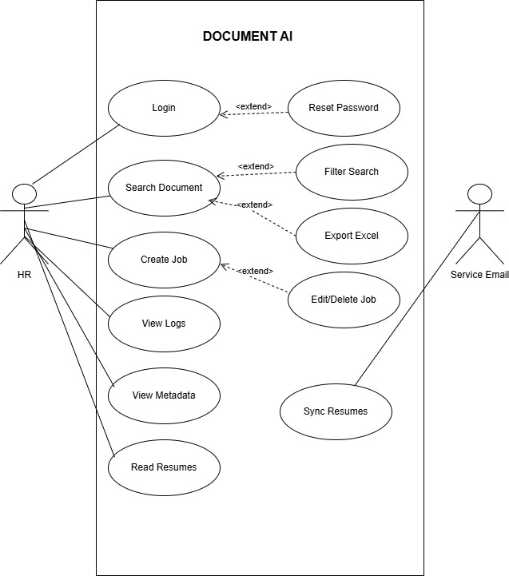{height=7in}

## Activity Diagram

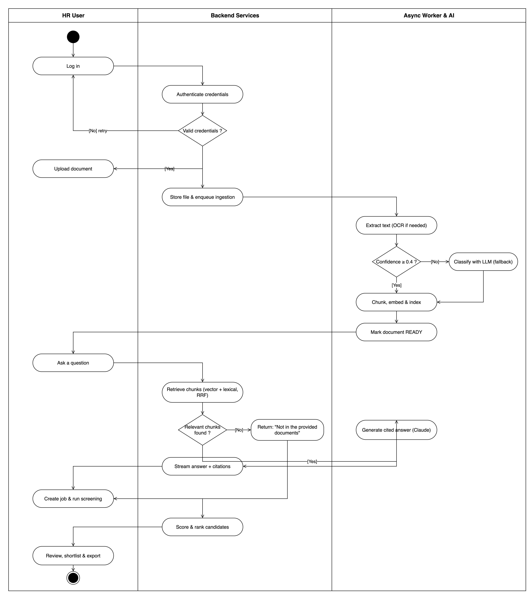{height=7in}

## DFD Level 0

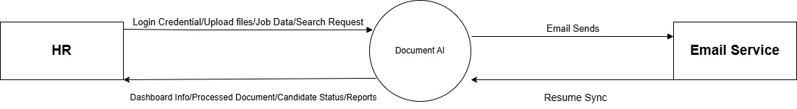{width=10in}

## DFD Level 1

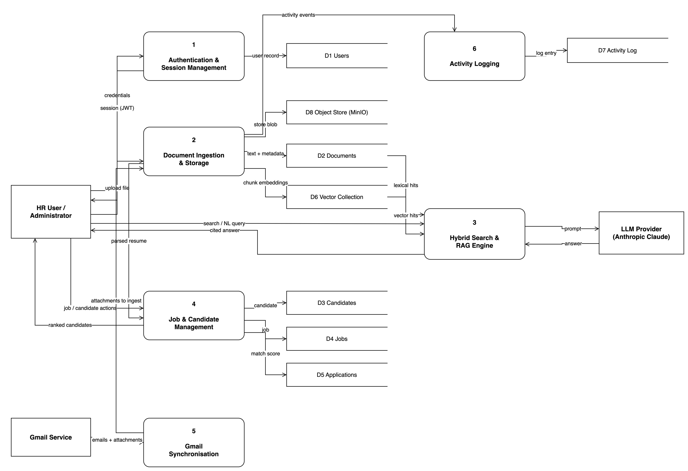{height=7in}

## DFD Level 2

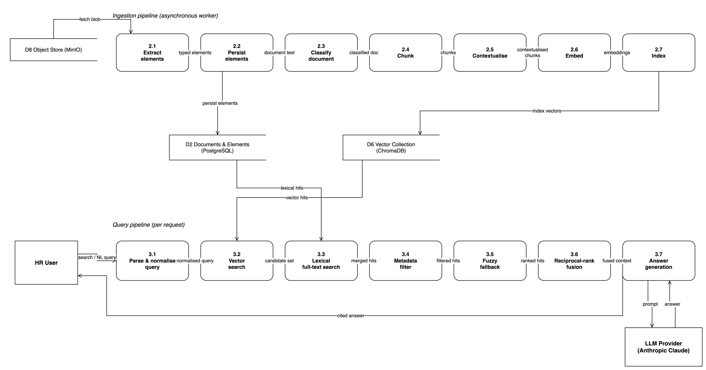{width=10in}

## Class Diagram

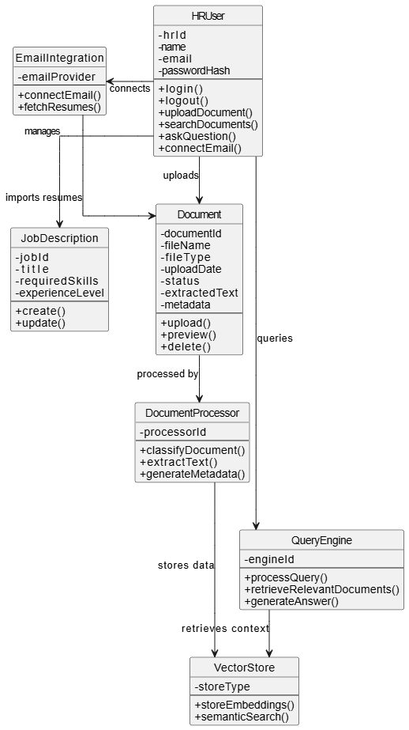{height=7in}

# Contribution

## Key Contributions

::: {.columns}
::: {.column width="50%"}
**Technical Contributions**

- Unified document and HR platform
- RAG-based question answering
- Semantic search implementation
- Hybrid chunking strategy for resumes
:::

::: {.column width="50%"}
**Practical Contributions**

- Automated email resume collection
- AI-powered candidate ranking
- Natural language interface
- Reduced manual screening effort
:::
:::

## Benefits

| Benefit | Description |
|---------|-------------|
| Time Savings | Reduces hours spent on manual document review |
| Improved Accuracy | AI reduces human errors in screening |
| Scalability | Handles large document collections efficiently |
| Ease of Use | Natural language queries, no training needed |
| Integration | Works with existing Gmail accounts |
| Compliance | Activity logging for audit trails |

## Comparison with Existing Solutions

| Aspect | Traditional Systems | Proposed System |
|--------|---------------------|-----------------|
| Search | Keyword-based | Semantic (meaning-based) |
| Q&A | Not available | RAG-powered answers |
| Resume Collection | Manual download | Automated Gmail sync |
| Candidate Ranking | Manual or rule-based | AI-powered matching |
| Platform | Separate tools | Unified solution |

# Limitations

## Current Limitations

::: {.columns}
::: {.column width="50%"}
**Technical Limitations**

- English language documents only
- OCR accuracy depends on scan quality
- Requires AI model API access
- GPU recommended for local models
:::

::: {.column width="50%"}
**Scope Limitations**

- Limited to PDF, Word, images
- Single organization deployment
- Internet required for email sync
- Designed for medium-scale workloads
:::
:::

## Future Improvements

::: {.columns}
::: {.column width="50%"}
**Technical Enhancements**

- Multi-language support
- Improved OCR accuracy
- Custom model fine-tuning
- Advanced analytics dashboard
:::

::: {.column width="50%"}
**Feature Additions**

- Additional email providers
- Mobile application
- Multi-tenant support
- Integration with HRIS systems
:::
:::

# User Interface

## Login Screen

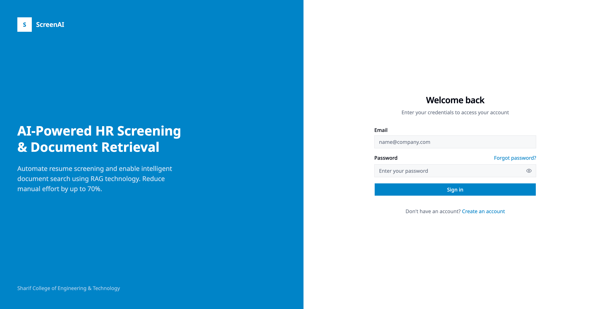{width=10in}

## Signup Screen

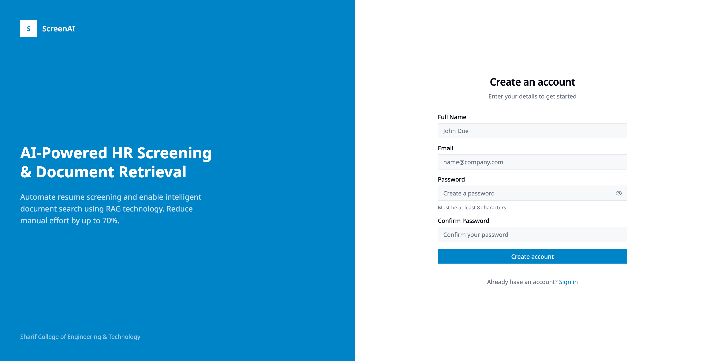{width=10in}

## Dashboard

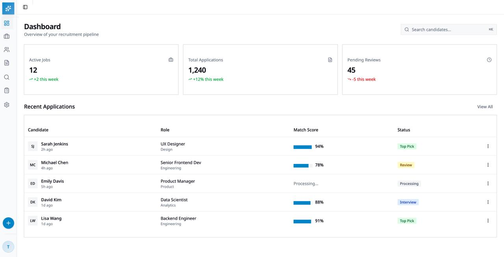{width=10in}

## Document Management

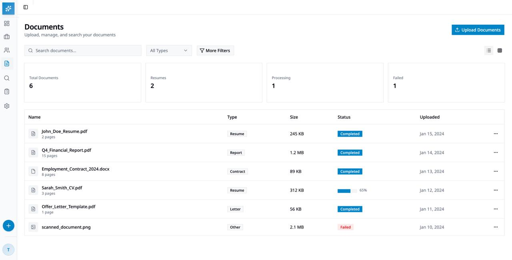{width=10in}

## Search and RAG Interface

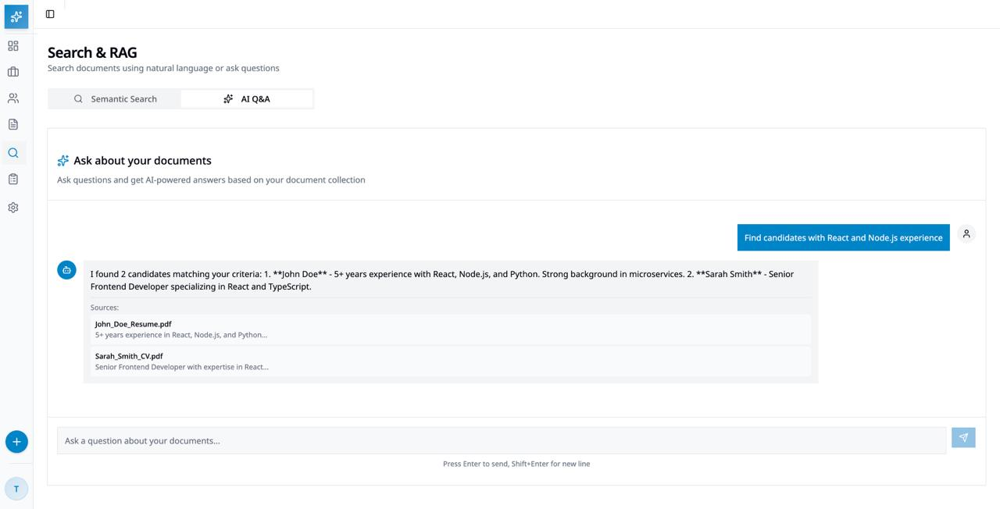{width=10in}

## Jobs Listing

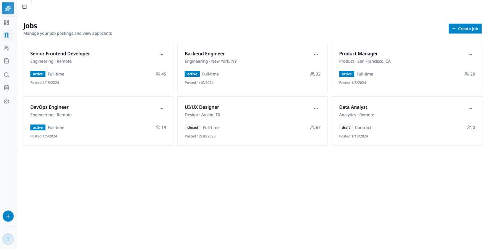{width=10in}

## Create Job

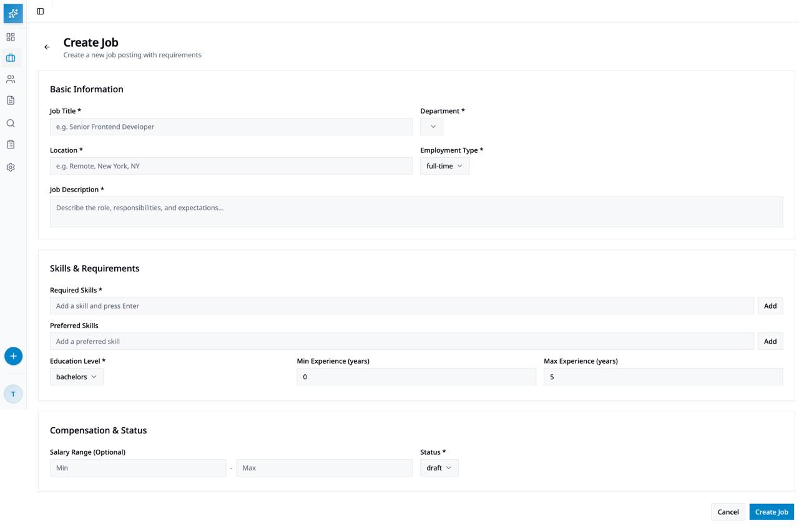{width=10in}

## Candidates / Resume Screening

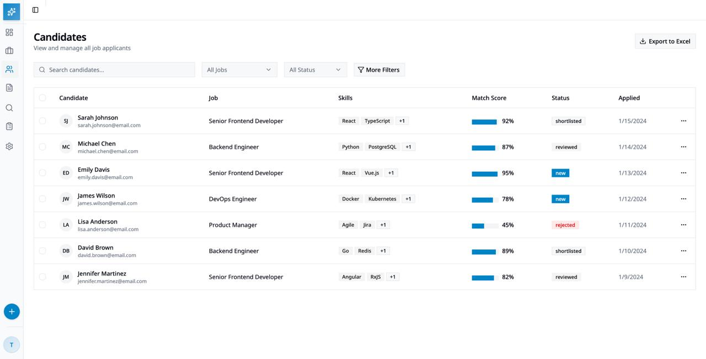{width=10in}

# Thank You
